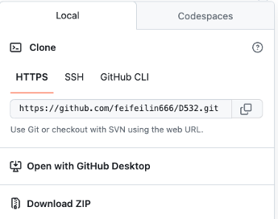

# D532 - Final Project

## Stock Portfolio Tracker
Our team, Group 9, has decided to create a stock portfolio tracker from historical stock data that will allow the user to update their portfolio and see how their changes have impacted the projected portfolio performance based on historical trends. 
## Project Description
### Team
Group 9 (Dustin Cole, Feifei Lin, Lee Johnson)
### Objectives
Our project is aimed at beginner stock traders who want to understand the impact of their portfolio decisions. The user will have the ability to add/delete stocks from their portfolio, change the amount of shares they own, change a sell/buy recommendation, or create different performance scenarios. This tracker is aimed at those who want to clearly see the performance of their stock portfolio while being able to look at different scenarios to help make buy/sell decisions. The primary problem we are trying to solve is to create an incentive for people to invest more. The simplicity and ease of use of our tracker will help overcome some common barriers to investing including not understanding the future impact of certain investment decisions. 
### Usefulness
Our tracker will be useful due to its ease of use and the ability to see performance projections based on the user’s investment decisions. Similar databases may exist as part of services offered by online stockbrokers (TD Ameritrade, Etrade, etc.), but unlike these other services, our tracker will help the beginner stock trader make better investment decisions via our projected performance visualizations, buy/sell recommendations, and scenario creation functionality.
### Dataset
~33K records. The dataset includes the company name, symbol, and historical volume and price data. For our proof of concept, we have selected Europe/Asia Tech Mega/Large/Medium NYSE stocks from Nasdaq.com. This is historical data for public use (stock trends, reference, etc.).
### Communication and Sharing:
* Communication Tool: Microsoft Teams
* Project github link: https://github.com/feifeilin666/D532
* shinyapps.io linK: https://lejohn3270.shinyapps.io/porttrack2/

## How to Build the Project
### Step 1 - Clone or download Github repository to local


### Step 2 - Run shiny app on local host
* make sure python is installed
```
python --version
```

* install shiny
```
pip install shiny
```

* run shiny app
```
shiny run --reload ~/D532/shinyapp/app.py
```

* successfully running the above commands will leave you with messages like
```
INFO:     Will watch for changes in these directories: ['/Volumes/workplace/Github/D532/shinyapp']
INFO:     Uvicorn running on http://127.0.0.1:8000 (Press CTRL+C to quit)
INFO:     Started reloader process [99727] using WatchFiles
INFO:     Started server process [99729]
INFO:     Waiting for application startup.
INFO:     Application startup complete.
```

* open a browser, and type in 
```
https://127.0.0.1:8000
```

### Step 3 - Run shiny app on shinyapps.io
* make sure you have a [shinyapps.io]() account

* install reconnect-python
```
pip install rsconnect-python
```

* configure rsconnect-python
```
rsconnect add \
    --account feifeilin666 \
    --name feifeilin666 \
    --token 876929CE694CF31A98711E49BBC40BEE \
    --secret <SECRET>
```

* generate manifest file
```
rsconnect write-manifest ~/D532/shinyapp/ --overwrite
```

* after generating manifest file, the file structure of your app should look like
```
app_name/
   app.py
   manifest.json
   requirements.txt
```

* deploy shiny app
```
rsconnect deploy shiny ~/D532/shinyapp --name feifeilin666 --title d532
```
